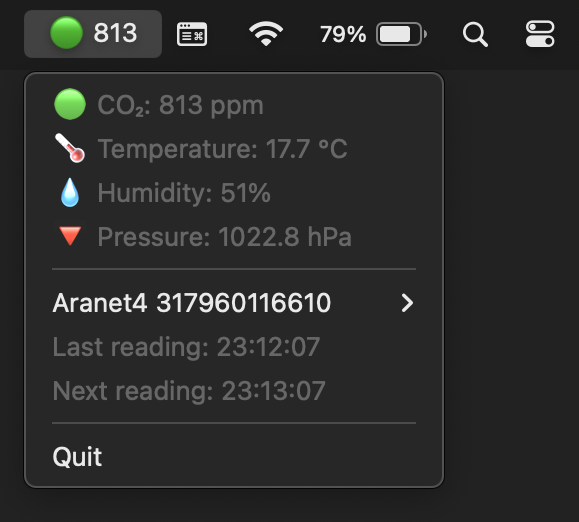

# Aramenu

A simple macOS menu bar app that displays data from an Aranet4 device.

Built with [rumps](https://github.com/jaredks/rumps) and [Aranet4-Python](https://github.com/Anrijs/Aranet4-Python).

Source only for now; proper documentation and downloads coming eventually.
